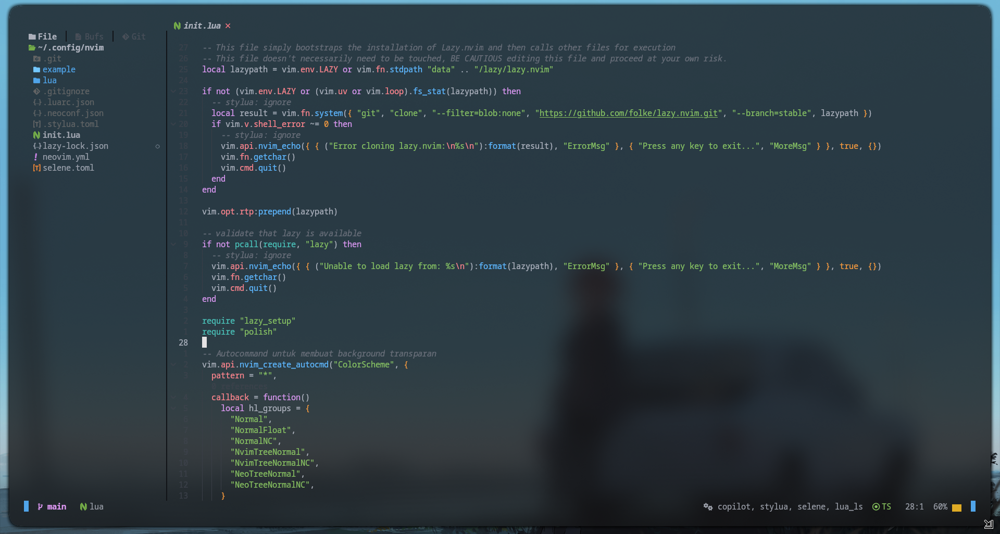
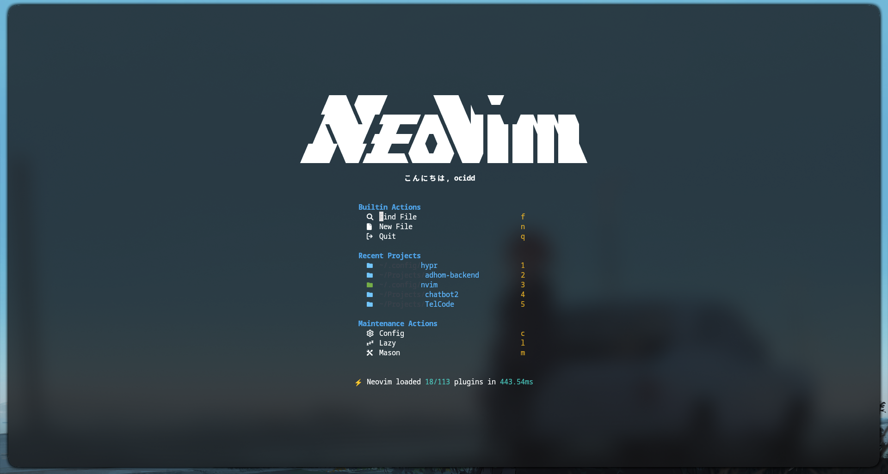

# ocidnvim

Personal [Neovim](https://neovim.io/) configuration built on
[AstroNvim](https://astronvim.com/) and [lazy.nvim](https://github.com/folke/lazy.nvim).
It includes LSP support, completion, formatting tools, Treesitter, Telescope,
Copilot, Copilot Chat, a custom dashboard, diagnostics, and a transparent
background theme.





## Requirements

Install these before starting Neovim:

- Neovim compatible with the current AstroNvim v6 release
- Git
- A C compiler and `make` for native plugins such as
  `telescope-fzf-native.nvim`
- A Nerd Font for the configured icons
- Node.js if you want to use GitHub Copilot
- Python if you want to use the configured `debugpy` debugger

This configuration is written for a Wayland desktop and uses `wl-clipboard`
for system clipboard integration. Install `wl-clipboard` or remove the
clipboard configuration in `lua/polish.lua` when using X11 or another
windowing system.

On Debian or Ubuntu, the base dependencies can be installed with:

```bash
sudo apt install neovim git make gcc wl-clipboard nodejs npm python3
```

The exact Neovim package available from a distribution repository may be too
old for AstroNvim. If that is the case, install a current Neovim release from
the [official releases](https://github.com/neovim/neovim/releases).

## Installation

Back up an existing configuration, clone this repository to Neovim's config
directory, and start Neovim:

```bash
mv ~/.config/nvim ~/.config/nvim.backup
git clone https://github.com/ociddaja2/ocidnvim.git ~/.config/nvim
nvim
```

If `~/.config/nvim` does not exist, the `mv` command will fail; in that case,
run only the `git clone` command.

On first launch, `lua/lazy_setup.lua` automatically downloads `lazy.nvim`.
lazy.nvim then installs the plugins from `lazy-lock.json` and the AstroNvim
community modules. Close and reopen Neovim after the initial installation if
any plugin or UI component has not loaded yet.

## First-time setup

### GitHub Copilot

Copilot is installed on demand. Run this inside Neovim to authenticate:

```vim
:Copilot auth
```

Copilot Chat is available after authentication. The main mappings are:

| Mapping | Action |
| --- | --- |
| `<leader>aa` | Toggle Copilot Chat |
| `<leader>ax` | Reset the chat |
| `<leader>aq` | Ask a quick question |
| `<leader>ap` | Select a prompt action |
| `<C-s>` | Submit a Copilot Chat prompt |

The leader key is `Space`.

### Mason tools

The configuration asks Mason to install these tools automatically:

- `lua-language-server`
- `stylua`
- `debugpy`
- `tree-sitter-cli`

Open `:Mason` to check their status or install/update tools manually.

## Main key mappings

| Mapping | Action |
| --- | --- |
| `]b` | Next buffer |
| `[b` | Previous buffer |
| `<leader>bd` | Pick a buffer to close |
| `<leader>F` | Find and replace the word under the cursor |
| `<leader>uY` | Toggle semantic highlighting for the current buffer |

The dashboard also provides shortcuts for finding files (`f`), creating a new
file (`n`), quitting (`q`), opening the configuration (`c`), opening lazy.nvim
(`l`), and opening Mason (`m`).

Use `<leader>` followed by the relevant group key to discover additional
AstroNvim mappings through which-key.

## Included functionality

- AstroNvim v6 as the base distribution
- lazy.nvim plugin management with a committed lockfile
- LSP configuration with format-on-save enabled
- Lua and Python AstroCommunity modules
- Blink completion with LSP, path, snippets, buffer, and Copilot sources
- Treesitter highlighting and indentation with automatic parser installation
- Telescope with the native FZF extension
- Mason and automatic installation of core language tools
- Noice command-line and notification UI
- Copilot and Copilot Chat
- Error Lens diagnostics
- Snacks dashboard with recent projects and maintenance actions
- Showkeys keystroke display
- Discord Rich Presence through `cord.nvim`
- Transparent highlight backgrounds and an `astrodark` colorscheme

## Updating

From inside Neovim, use:

```vim
:Lazy sync
```

To update Mason-managed tools, use:

```vim
:Mason
```

The plugin versions are pinned by `lazy-lock.json`. If you intentionally
change plugin versions, review the resulting lockfile changes before
committing them.

## Configuration layout

```text
.
├── init.lua                 # Entry point and lazy.nvim bootstrap
├── lua/lazy_setup.lua       # Plugin manager and AstroNvim setup
├── lua/community.lua        # AstroCommunity imports
├── lua/polish.lua           # Wayland clipboard configuration
├── lua/plugins/             # Local plugin specifications and overrides
├── lazy-lock.json           # Locked plugin revisions
└── example/                 # Configuration screenshots
```

Most customization belongs in `lua/plugins/`. The AstroNvim defaults are
loaded first, then AstroCommunity modules, and finally the local plugin
specifications in this repository.

## Troubleshooting

### Plugins do not install

Check that Git is available and that Neovim can reach GitHub. Then run
`:Lazy sync` and inspect `:Lazy` for the failing plugin.

### Native Telescope extension fails to build

Install a C compiler and `make`, remove the failed plugin build if needed, and
run `:Lazy build telescope-fzf-native.nvim`.

### Clipboard does not work

This setup expects Wayland and `wl-copy`/`wl-paste`. Verify that both commands
are installed and available in `$PATH`, or edit `lua/polish.lua` for the
clipboard tool used by your desktop session.

### Icons or dashboard glyphs look wrong

Install and select a Nerd Font in your terminal. The configuration uses
icon glyphs in completion menus, the dashboard, status UI, and notifications.
